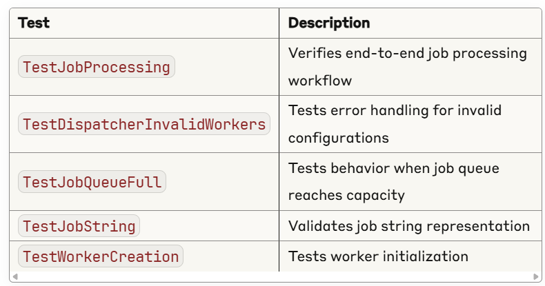

Go Job Queue

A simple, concurrent job processing system implemented in Go. 

This project demonstrates the worker pool pattern using goroutines, channels, and proper concurrent programming practices. Perfect for learning Go concurrency concepts or as a foundation for more complex job processing systems.

Features:

Concurrent Processing: Multiple workers process jobs simultaneously using goroutines

Thread-Safe Job Queue: Buffered channel-based job queue for asynchronous processing

Worker Pool Management: Configurable number of workers with round-robin job distribution

Graceful Shutdown: Clean worker termination with proper resource cleanup

Error Handling: Robust error handling for edge cases and invalid configurations

Comprehensive Testing: Full test suite covering various scenarios

Zero Dependencies: Uses only Go standard library

go-job-queue/
├── go.mod              # Go module definition
├── main.go             # Entry point - demo application
├── job.go              # Job struct definition
├── worker.go           # Worker implementation
├── dispatcher.go       # Dispatcher - manages worker pool
├── main_test.go        # Comprehensive test suite
└── README.md           # Documentation (this file)

Architecture

Job (job.go)

type Job struct {
    ID      int    // Unique identifier
    Payload string // Job data/task description
}

- Represents a unit of work to be processed
- Includes String() method for debugging

Worker (worker.go)

type Worker struct {
    ID          int           // Worker identifier
    JobChannel  chan Job      // Receives jobs to process
    QuitChannel chan bool     // Graceful shutdown signal
}

- Runs in its own goroutine
- Processes jobs with simulated work (configurable delay)
- Supports graceful shutdown via quit channel
  
Dispatcher (dispatcher.go)

type Dispatcher struct {
    JobQueue   chan Job     // Incoming job queue
    WorkerPool []*Worker    // Pool of workers
    MaxWorkers int          // Maximum number of workers
}

- Manages worker lifecycle (create, start, stop)
- Distributes jobs using round-robin algorithm
- Handles job queue overflow scenarios

Installation & Setup
Prerequisites

Go 1.21 or later
Git (optional, for cloning)

Setup Instructions

1. Create project directory:
mkdir go-job-queue && cd go-job-queue

2. Initialize Go module:
go mod init go-job-queue

3. Add the source files (copy all .go files into the directory)
4. Verify setup:
go mod tidy

Running the Application

Run the Demo

go run main.go

Expected Output:

Starting dispatcher with 3 workers
Worker 1 starting
Worker 2 starting
Worker 3 starting

Submitting 8 jobs...
Submitted Job{ID: 1, Payload: Task-1} to job queue
Submitted Job{ID: 2, Payload: Task-2} to job queue
...

Processing jobs...
Worker 1 processing Job{ID: 1, Payload: Task-1}
Worker 2 processing Job{ID: 2, Payload: Task-2}
Worker 3 processing Job{ID: 3, Payload: Task-3}
Worker 1 completed Job{ID: 1, Payload: Task-1}
...

Stopping dispatcher...
Worker 1 stopping
Worker 2 stopping
Worker 3 stopping
All workers stopped

Run All Tests

go test

Verbose Test Output

go test -v

Run Specific Test
go test -v -run TestJobProcessing

Test Coverage
go test -cover

📊 Test Suite

The project includes comprehensive tests covering:

Configuration

Modify these constants in main.go to customize behavior:

const (
    maxWorkers   = 3   // Number of worker goroutines
    jobQueueSize = 10  // Job queue buffer size
    numJobs      = 8   // Number of demo jobs
)

Configuration Guidelines

maxWorkers: Typically set to number of CPU cores or based on I/O characteristics

jobQueueSize: Should accommodate expected job 

Processing delay: Adjust time.Sleep in worker.go for different work simulation

Learning Concepts
This project demonstrates key Go concepts:

Goroutines: Lightweight threads for concurrent execution
Channels: Communication between goroutines
Select Statements: Non-blocking channel operations
WaitGroups: Synchronizing goroutine completion
Worker Pool Pattern: Common concurrency design pattern
Graceful Shutdown: Clean resource cleanup
Error Handling: Robust error management in concurrent systems
Testing: Unit testing concurrent code
Project Organization: Go project structure and package management